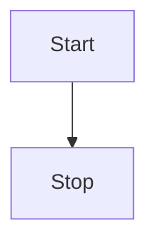

# YouTube Clone App

The goal of this project is to create a video-sharing and streaming platform, a YouTube "clone". 

## Components 

### Frontend and BFF (Backend For Frontend)
- React.js, next.js, typescript
Responsible for rendering the user interface, handling user interactions, and making API requests to the backends.

### Cloud Storage
- AWS S3 or Google Cloud Storage or Azure Storage
Stores the video files and thumbnails

### Video Processing/Transcoding Service
- Self-hosted (FFmpeg) or Cloud Video Processing Services (AWS Elemental MediaConvert, Google Cloud Video Intelligence API, Azure Media Services )
Converts uploaded videos into various formats and resolutions suitable for streaming across different devices

### micro service backends
while 20,000 and 50,000 Daily Active Users could be handled by one backend and one DB, Using multiple services will make the project more future proof and better structure the project

#### Authentication Service
- nodejs
- server (express) or serverless (aws lambda) or 3rd party
- DB: relational(PostgreSQL)
usernames, passwords, Authentication Tokens

#### User profiles services
- nodejs
- server (express) or serverless (aws lambda)
- DB: relational(PostgreSQL)
personal info, favorites, personal likes, subscriptions, history

#### Channel service
- nodejs
- server (express) or serverless (aws lambda)
- DB: relational(PostgreSQL)
for people that upload videos, channels info, subscriber count

#### Search Service
- nodejs
- server (express) or serverless (aws lambda)
- DB: relational(PostgreSQL) or indexing (elasticsearch) depending on the budget
returns a video list given a search query, indexation

#### Home feed Service
- nodejs
- server (express) or serverless (aws lambda)
- DB: relational(PostgreSQL)
Give a list of video to show on an user (or anonymous user) homepage or any other feeds

#### Reactions Service
- nodejs
- server (express) or serverless (aws lambda)
- DB: Key value  (redis, dynamo db)
Like and comments on videos. 

#### Metrics service
- 3rd party (datadog) or in house data engineering team's service
Collect data about everything. Could be used to find out which audience like which kind of videos