# YouTube Clone App

The goal of this project is to create a video-sharing and streaming platform, a YouTube "clone". 

## Components 

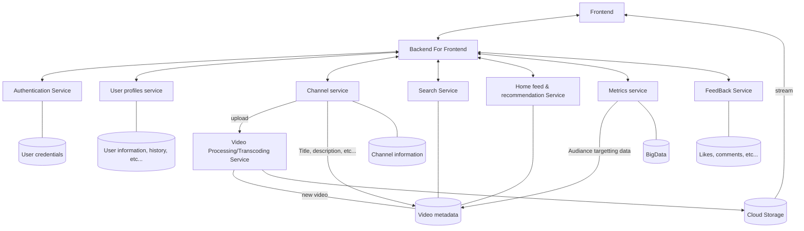
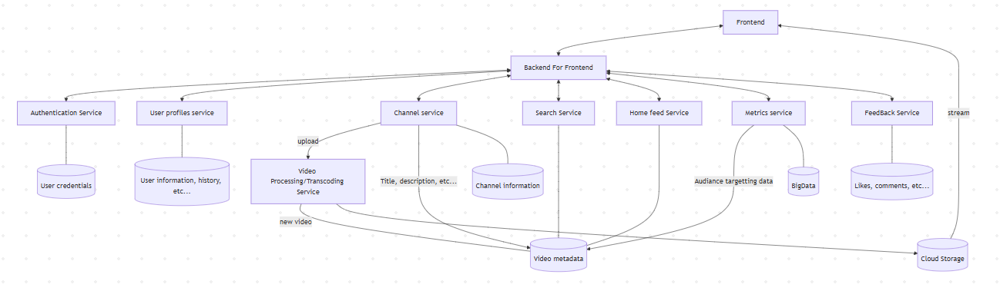

### Frontend and BFF (Backend For Frontend)
- React.js, next.js, typescript
- could use GraphQL for the BFF

Responsible for rendering the user interface, handling user interactions, and making API requests to the backends.

### Cloud Storage
- AWS S3 or Google Cloud Storage or Azure Storage

Stores the video files and thumbnails

### Video Processing/Transcoding Service
- Self-hosted (FFmpeg) or Cloud Video Processing Services (AWS Elemental MediaConvert, Google Cloud Video Intelligence API, Azure Media Services )

Converts uploaded videos into various formats and resolutions suitable for streaming across different devices

### micro service backends
while 20,000 and 50,000 Daily Active Users could be handled by one backend and one DB, Using multiple services will make the project more future proof and better structure the project

#### Authentication Service

usernames, passwords, Authentication Tokens
- nodejs
- server (express) or serverless (aws lambda) or 3rd party
- DB: relational(PostgreSQL)

#### User profiles service

personal info, favorites, personal likes, subscriptions, history
- nodejs
- server (express) or serverless (aws lambda)
- DB: relational(PostgreSQL)

#### Channel service

for people that upload videos, channels info, subscriber count
- nodejs
- server (express) or serverless (aws lambda)
- DB: relational(PostgreSQL)

#### Search Service

returns a video list given a search query, indexation, show meta data for current video
- nodejs
- server (express) or serverless (aws lambda)
- DB: relational(PostgreSQL) or indexing (elasticsearch) depending on the budget

#### Home feed & recommendation Service

Give a list of video to show on an user (or anonymous user) homepage or any other feeds
- nodejs
- server (express) or serverless (aws lambda)
- DB: relational(PostgreSQL)

#### FeedBack Service
Like and comments on videos. 
- nodejs
- server (express) or serverless (aws lambda)
- DB: Key value  (redis, dynamo db)

#### Metrics service
Collects data about everything. Could be used to find out which audience like which kind of videos
- 3rd party (datadog) or in house data engineering team's service

## User interactions and flows
### User Authentication
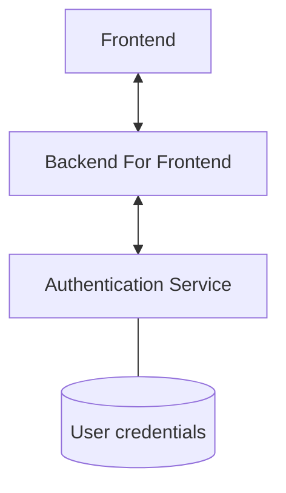
### Trending and Recommended Videos
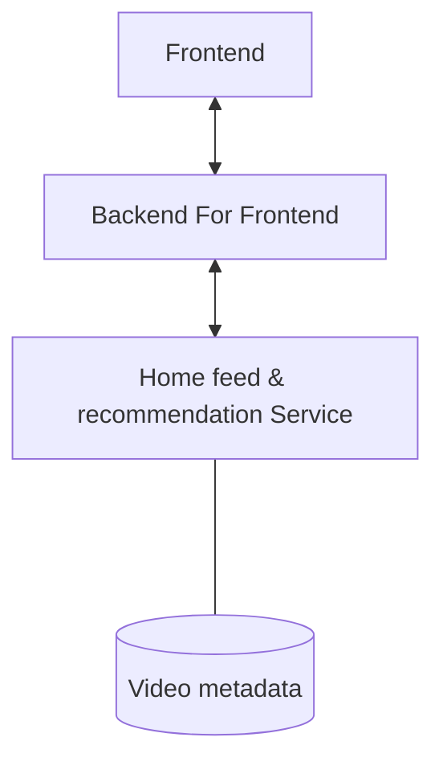
### Video page

### Video Playback and save progress in history

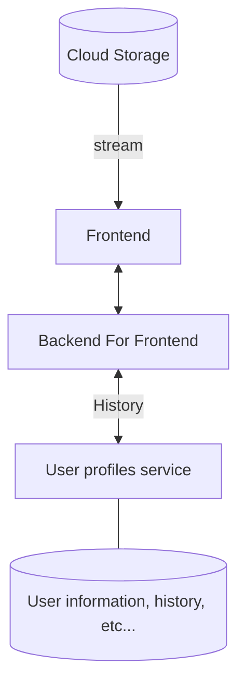
### Video Upload
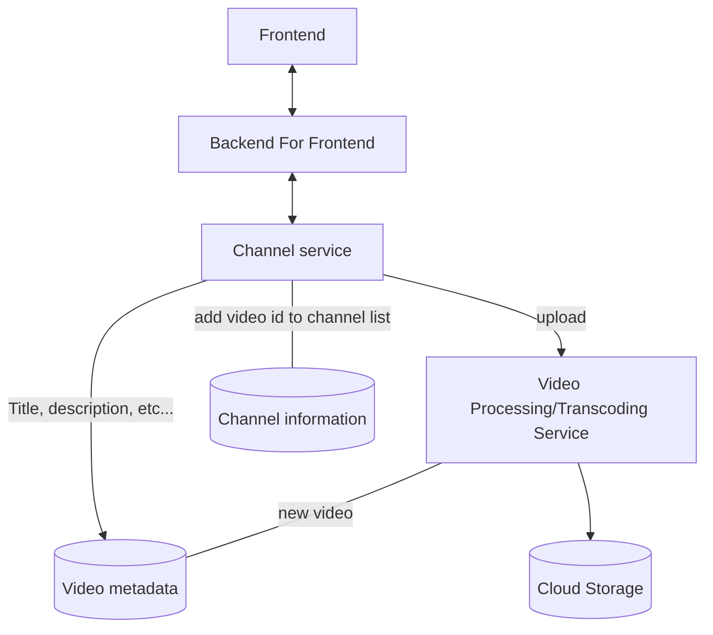

### Search
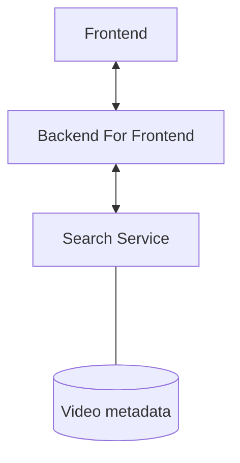

### Video Interactions
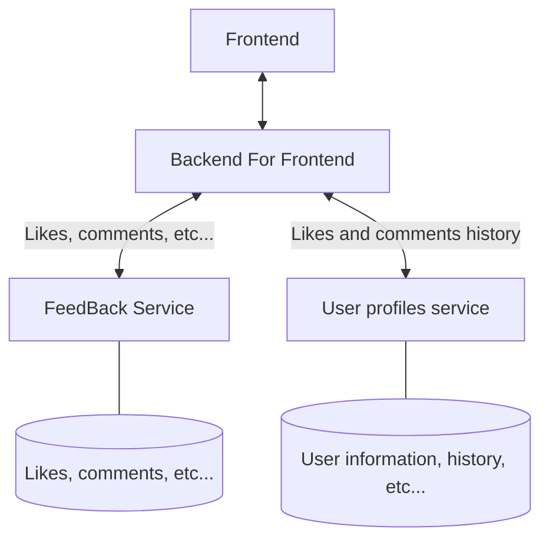

### Channel Subscriptions
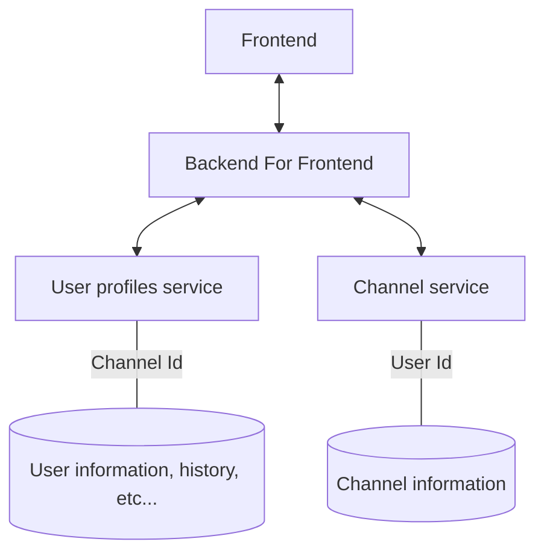

### Tracking user actions 
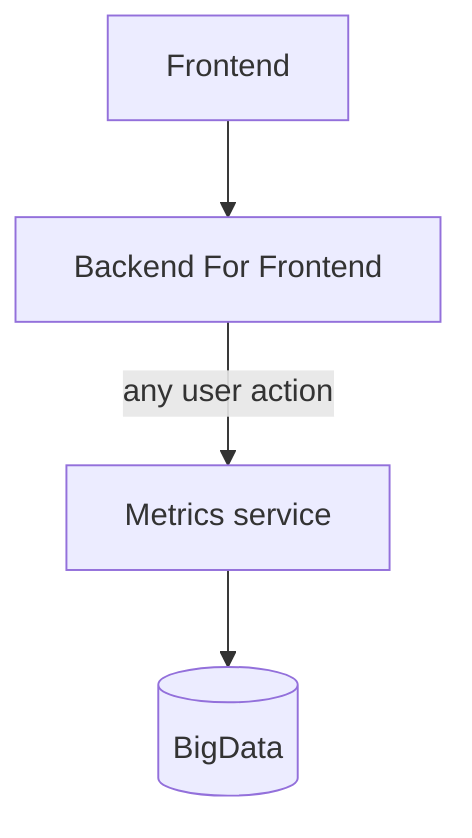
### Use Tracked user actions to create audience targeting data

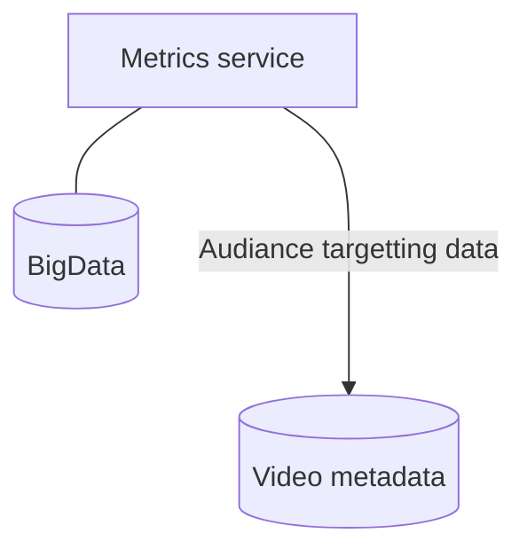