# YouTube Clone App

The goal of this project is to create a video-sharing and streaming platform, a YouTube "clone".

## Components

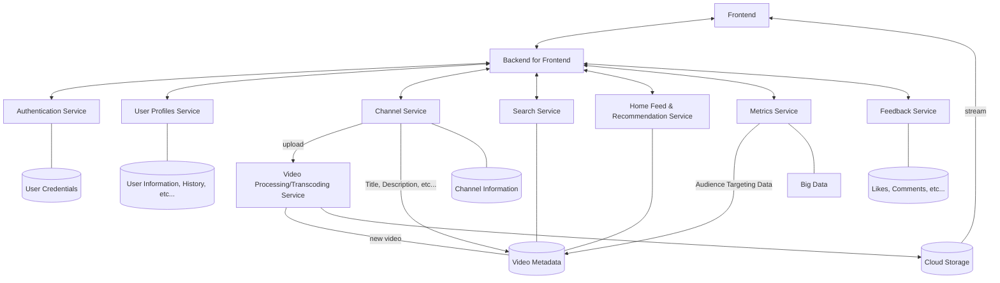

### Frontend and BFF (Backend for Frontend)
- React.js, Next.js, TypeScript
- Could use GraphQL for the BFF

Responsible for rendering the user interface, handling user interactions, and making API requests to the backends.

### Cloud Storage
- AWS S3, Google Cloud Storage or Azure Storage

Stores the video files and thumbnails

### Video Processing/Transcoding Service
- Self-hosted (FFmpeg) or Cloud Video Processing Services (AWS Elemental MediaConvert, Google Cloud Video Intelligence API, Azure Media Services)

Converts uploaded videos into various formats and resolutions suitable for streaming across different devices

### Microservice Backends
While 20,000 to 50,000 Daily Active Users could be handled by one backend and one database, using multiple services will make the project more future-proof and better structure the project.

#### Authentication Service
Handles usernames, passwords, authentication tokens.
- Node.js
- Server (Express) or serverless (AWS Lambda) or 3rd party
- DB: Relational (PostgreSQL)

#### User Profiles Service
Manages personal info, favorites, likes, subscriptions, history.
- Node.js
- Server (Express) or serverless (AWS Lambda)
- DB: Relational (PostgreSQL)

#### Channel Service
For users who upload videos, manages channel info and subscriber count.
- Node.js
- Server (Express) or serverless (AWS Lambda)
- DB: Relational (PostgreSQL)

#### Search Service
Returns a video list given a search query, handles indexing, shows metadata for current video.
- Node.js
- Server (Express) or serverless (AWS Lambda)
- DB: Relational (PostgreSQL) or indexing (Elasticsearch) depending on the budget

#### Home Feed & Recommendation Service
Provides a list of videos to show on a user's (or anonymous user's) homepage or other feeds.
- Node.js
- Server (Express) or serverless (AWS Lambda)
- DB: Relational (PostgreSQL)

#### Feedback Service
Handles likes and comments on videos.
- Node.js
- Server (Express) or serverless (AWS Lambda)
- DB: Key-value (Redis, DynamoDB)

#### Metrics Service
Collects data about everything. Can be used to find out which audience likes which kind of videos.
- 3rd party (Datadog) or in-house data engineering team's service

## User Interactions and Flows
### User Authentication
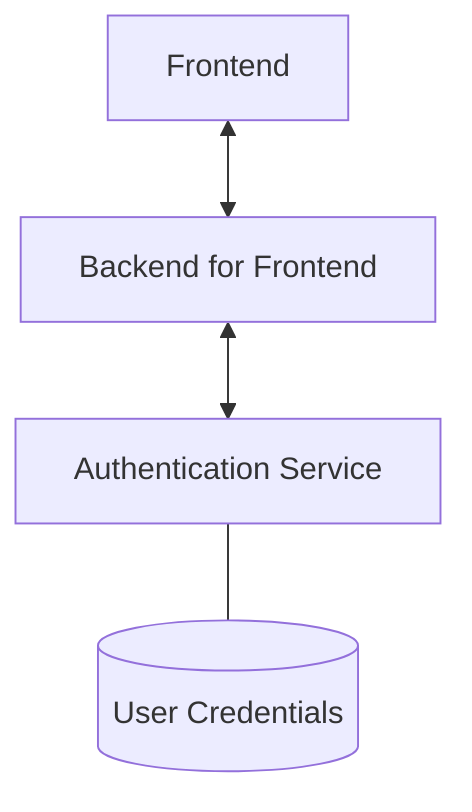
### Trending and Recommended Videos
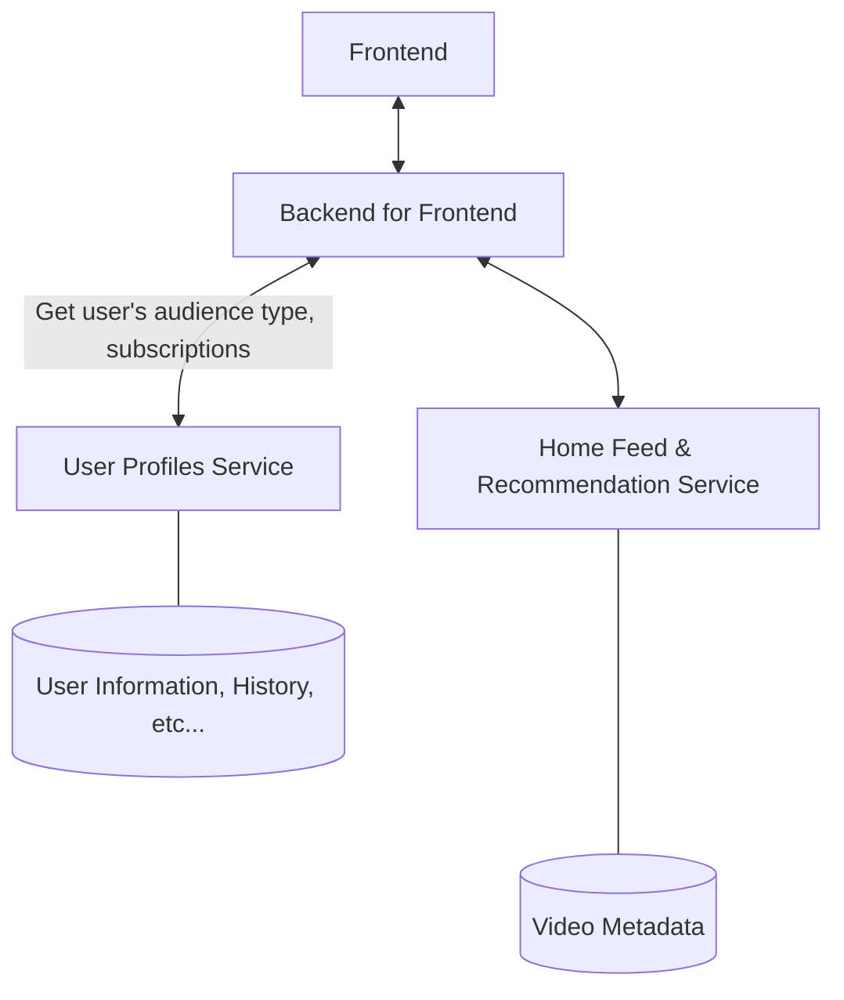

### Video Page
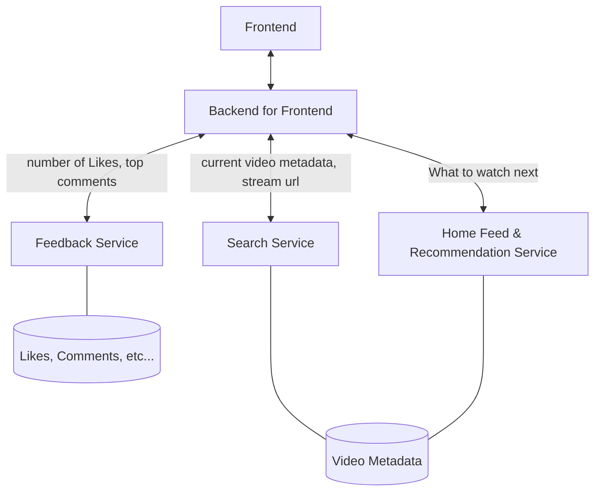
### Video Playback and Save Progress in History
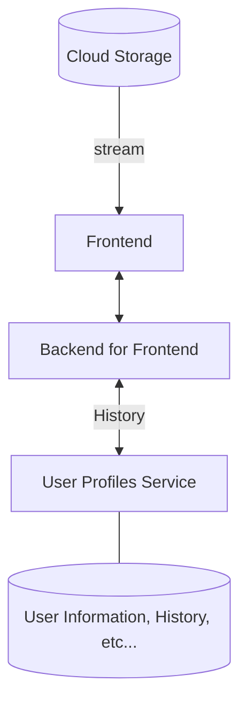
### Video Upload
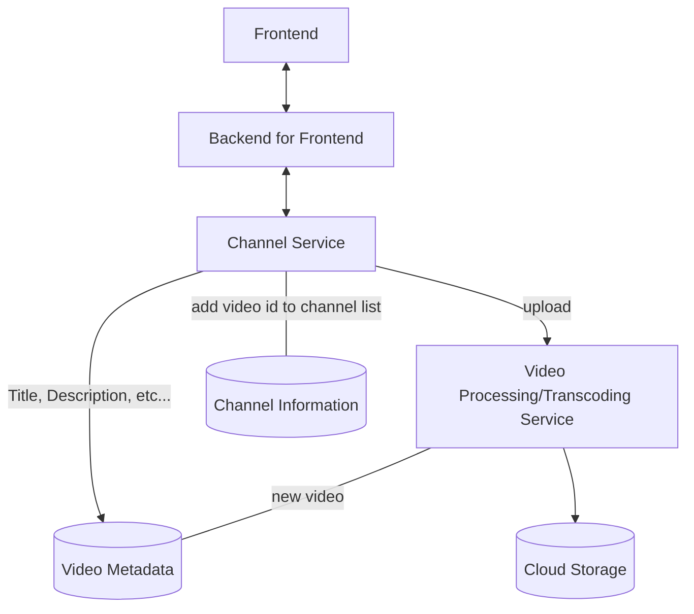

### Retrieve History
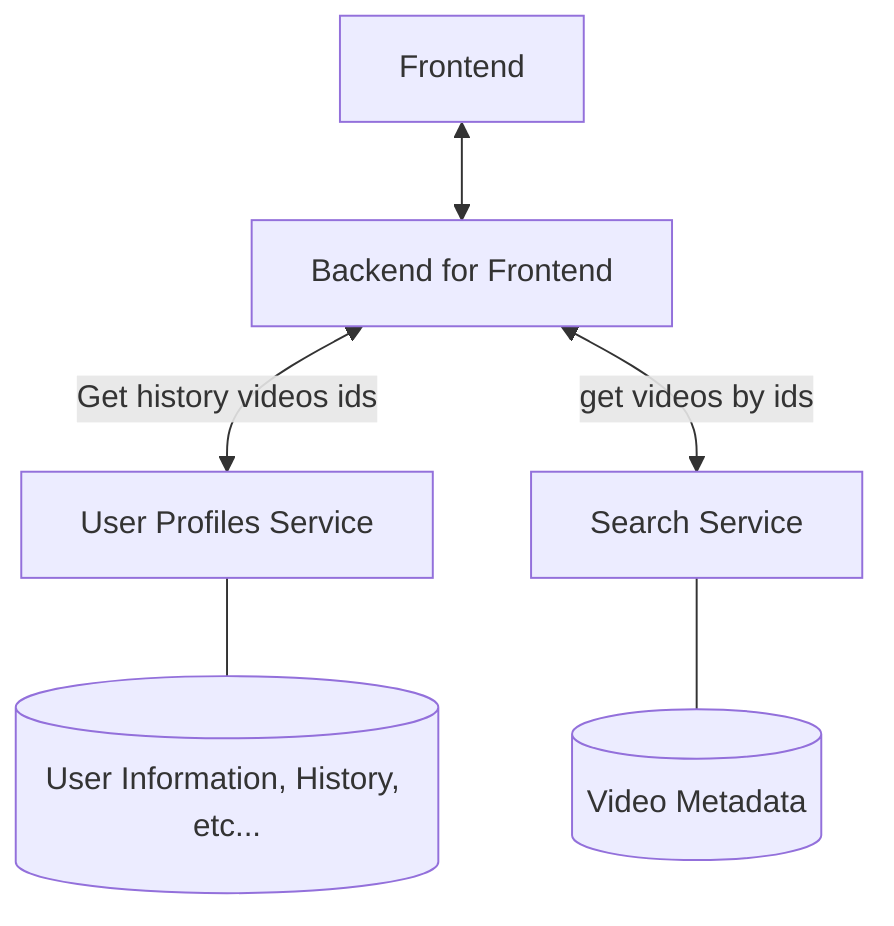

### Search
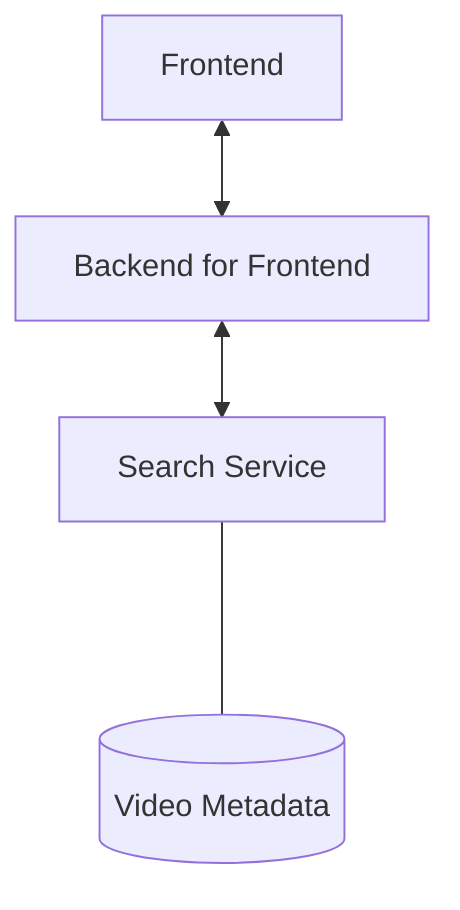

### Video Interactions

### Channel Subscriptions
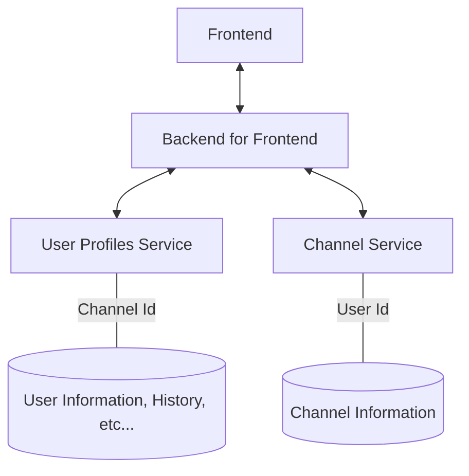

### Tracking User Actions
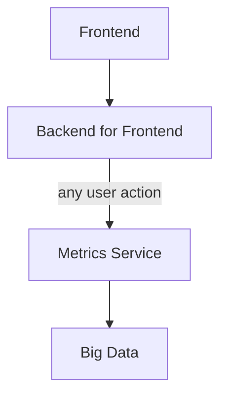
### Use Tracked User Actions to Create Audience Targeting Data
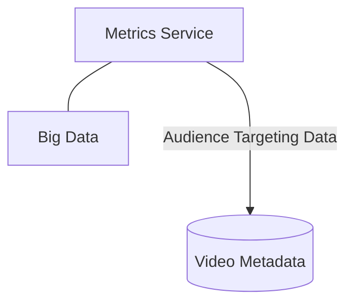